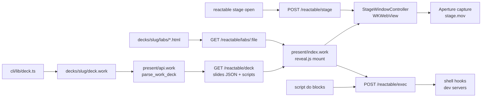

# Stage pipeline — `.work` weave

The **stage** is Reactable's only presentation surface. Preview, rehearsal, and
metal capture all use the same native `WKWebView` loading `/present?deck=<slug>`.
There is no separate browser preview path.

## Weave (authoring → pixels)



## Layers

| Layer | File | Role |
|-------|------|------|
| Author | `decks/<slug>/deck.work` | `slide do`, `script do`, `preload do`, `client :unit` |
| Parse | `present/api.work` | Prose → HTML, client islands, iframe/video slides |
| Serve | nexus `:4020` | `/reactable/deck`, `/reactable/labs`, `/reactable/exec`, `/reactable/stage` |
| Render | `present/index.work` | Fetch deck, mount slides, reveal.js navigation, script runner |
| Shell | `native/StageWindow.swift` | Floating window, bridge events, capture crop |
| Agent | `cli/bin/reactable.ts` | Edit decks, `stage open`, takes post |

## deck.work blocks

```work
deck do … end          # id + title
preload do … end       # warm iframe URLs
script do … end        # shell on deck.open / slide.enter / record.start
slide do … end         # slide header + optional prose/html body below
client :name do … end  # reusable HTML island (type: client, unit: name)
```

Optional: `decks/<slug>/slides/*.work` — extra `slide do` files merged after inline slides.

## Slide → stage rendering

| `type:` | API output | Stage DOM |
|---------|------------|-----------|
| `prose` | `type: html`, `body` (rendered) | `.work-prose` div |
| `html` | raw `body` | innerHTML |
| `client` | `body` from `client :unit` | innerHTML |
| `iframe` | `url`, `title`, `actions` | full-bleed `<iframe>` |
| `video` | `src`, `actions` | `<video controls>` |
| `youtube` | `videoId` | embed iframe |

Labs under `decks/<slug>/labs/` are served same-origin:

`/reactable/labs/counter.html?deck=<slug>`

Use in iframe slides so apps run **inside** the stage while you move slide to slide.

## Scripts (two runtimes)

**In-slide actions** (`action: wait 500`, `action: play`) — reveal.js runtime in
`present/index.work`. No shell.

**Deck scripts** (`script do`) — shell via `POST /reactable/exec`:

| `on:` | Fired by |
|-------|----------|
| `deck.open` | Stage JS after Reveal init |
| `slide.enter` | Stage JS on navigation |
| `record.start` | Swift before Aperture capture |

Dev servers: `detach: true`, `cwd:` under deck folder, optional `url:` for agents.

## Agent preview (must use stage)

```bash
just reactable dev                    # native app + nexus
reactable stage open --deck showcase  # same WKWebView as recording
reactable stage status --json         # verify deck + visible
```

`reactable open present` is deprecated — it previously opened Safari/Chrome, which
is **not** the recorded surface.

## Events during capture

Stage JS → `window.webkit.messageHandlers.reactable` → Swift → `events.jsonl`:

- `slide` — index + id + notes
- `notes` — speaker notes text (also shown in native panel when enabled)
- `deck` — deck loaded

## Hard rule

**If it isn't visible in the stage window, it isn't the product.** Author labs,
embeds, and prose so they render inside `/present` slide sections — not as
external browser tabs the user would have to context-switch to.
