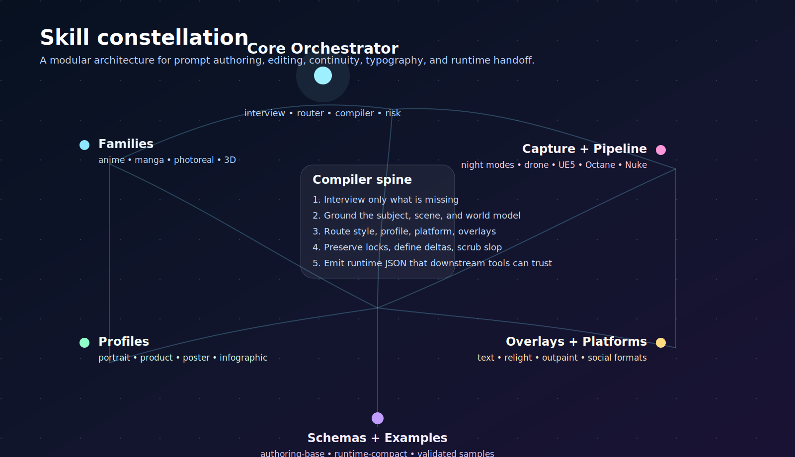

# Nano Banana Image Skill

[](LICENSE)
[](https://github.com/Emily2040/nano-banana-image-skill/actions/workflows/validate.yml)
[](#compatibility-strategy)
[](#github-pages-front-end)


A production-grade, agent-portable image prompting skill for **Nano Banana Pro** and **Nano Banana 2 / V2** in the Gemini image family. It turns fuzzy creative requests into clean interview questions, grounded art direction, model-aware prompt stacks, edit-preservation deltas, and structured JSON payloads.

The skill is built as an **open Agent Skills** package with a canonical `SKILL.md` entrypoint, plus companion files for agents that prefer `AGENTS.md`, `CLAUDE.md`, or `GEMINI.md`.

---

## What this skill is for

Use this repo when you want an agent to do any of the following well:

- write high-precision prompts for Gemini image generation,
- transform vague art direction into a complete production brief,
- preserve subject identity across edits and variants,
- create text-in-image layouts that do not collapse into typographic soup,
- route a request into the right style family, genre, movement, culture, capture mode, rendering pipeline, and output profile,
- package the final answer as structured JSON for downstream apps or API calls.

The skill is optimized for both **speed workflows** using Nano Banana 2 / V2 for fast iteration, and **high-fidelity workflows** using Nano Banana Pro for complex reasoning, stronger text rendering, and tighter instruction following.

---

## Companion package

This repository now includes a broader companion skill at [`packages/model-aware-image-prompt-engineer`](packages/model-aware-image-prompt-engineer/README.md).

Use it when the target is not only Nano Banana. It routes image prompts across Gemini, OpenAI image models, Midjourney, FLUX, Qwen-Image, Z-Image, Stable Diffusion, Pony, Illustrious, NoobAI, Animagine, HunyuanImage, HiDream, OmniGen2, Sana, PixArt, Kolors, Chroma, Runway, Ideogram, Firefly, Recraft, Luma, local ComfyUI workflows, and hosted wrappers.

It also includes a public README hero and infographic:

- [`assets/hero.png`](packages/model-aware-image-prompt-engineer/assets/hero.png)
- [`assets/infographic.png`](packages/model-aware-image-prompt-engineer/assets/infographic.png)

---

## Model targets

| Friendly name | Canonical model target | Best for |
|---|---|---|
| Nano Banana Pro | `gemini-3-pro-image-preview` | premium text rendering, complex layouts, infographics, poster work, careful edits |
| Nano Banana 2 / V2 | `gemini-3.1-flash-image-preview` | fast ideation, multi-variant batches, speedy edits, responsive iteration |
| Nano Banana | `gemini-2.5-flash-image` | legacy fast path, lightweight tasks |

The skill keeps model choice explicit in both the human-readable brief and the runtime JSON.

**Gemini API note:** Google currently documents Gemini image generation through `generateContent`, with `gemini-3-pro-image-preview` for Nano Banana Pro, `gemini-3.1-flash-image-preview` for Nano Banana 2 / V2, and `gemini-2.5-flash-image` for the legacy fast path. Keep prompt text, image config, source references, and provenance notes separate in runtime payloads.

---

## Design goals

| Goal | How |
|---|---|
| **Portable** | Canonical `SKILL.md` for skill-aware agents, plus `AGENTS.md`, `CLAUDE.md`, and `GEMINI.md` for ecosystem-specific loaders. |
| **Modular** | Core prompting logic split into focused files under `skills/core/`. Style and output families live in their own registries. Schemas and examples separated cleanly. |
| **Beautiful** | Includes a GitHub Pages front-end in `docs/` with ImageGen raster artwork, SVG diagrams, and a polished landing page. |
| **Deployable** | Ships with a validation script, example compiler, and GitHub Actions CI workflow. |

---

## Repository structure

```text
nano-banana-image-skill/
├─ README.md
├─ SKILL.md                  # Canonical entrypoint (slim, under 500 chars)
├─ references/
│  └─ 00-orchestrator.md     # Full workflow (progressive disclosure)
├─ AGENTS.md                 # Codex / AGENTS-style context
├─ CLAUDE.md                 # Claude Code memory
├─ GEMINI.md                 # Gemini CLI memory
├─ agents/
│  └─ openai.yaml            # Codex UI metadata
├─ LICENSE                   # Apache-2.0
├─ .gitignore
├─ Makefile
├─ requirements-dev.txt
├─ schemas/
│  ├─ authoring-base.json    # Rich authoring contract
│  ├─ runtime-compact.json   # Compact runtime payload
│  └─ pack-format.json       # Pack manifest schema
├─ registry/
│  ├─ style-axes.md          # Style taxonomy
│  ├─ aliases.json           # Model and style aliases
│  ├─ forbidden-slop.json    # Slop scrubbing rules
│  ├─ interview-question-bank.json
│  └─ token-budgets.json
├─ skills/
│  ├─ core/                  # 20+ modular guidance files
│  ├─ families/              # Style family modules
│  ├─ genres/                # Genre modules
│  ├─ movements/             # Art movement modules
│  └─ ...                    # cultures, capture, pipelines, etc.
├─ examples/
│  ├─ authoring/             # 5 rich authoring briefs
│  └─ runtime/               # 5 matching runtime payloads
├─ scripts/
│  ├─ validate_repo.py       # Repository validator
│  ├─ compile_runtime.py     # Authoring-to-runtime compiler
│  └─ compile_gemini_request.py # Runtime-to-Gemini request skeleton
├─ docs/
│  ├─ index.html             # GitHub Pages landing page
│  └─ assets/                # Raster and SVG artwork (hero, infographic, flow, etc.)
└─ .github/workflows/
   └─ validate.yml           # CI validation workflow
```

---

## Compatibility strategy

| Client style | Primary file | Behavior |
|---|---|---|
| Open Agent Skills / skill-aware agents | `SKILL.md` | Canonical root entrypoint with progressive disclosure via `references/`. |
| AGENTS-style project guidance | `AGENTS.md` | Points the agent to the canonical skill and repo workflow. |
| Claude Code memory | `CLAUDE.md` | Loads concise repo-specific memory without replacing the skill. |
| Gemini CLI / Gemini Code Assist | `GEMINI.md` | Imports the canonical skill and references supporting files. |

---

## Quick start

### Clone the repository

```bash
git clone https://github.com/Emily2040/nano-banana-image-skill.git
cd nano-banana-image-skill
```

### Install as a skill

**Codex / skill-aware clients:**
```bash
mkdir -p ~/.agents/skills
ln -s /path/to/nano-banana-image-skill ~/.agents/skills/nano-banana-image-skill
```

**Claude Code:**
```bash
mkdir -p ~/.claude/skills
cp -R nano-banana-image-skill ~/.claude/skills/
```

**Gemini CLI / Gemini Code Assist:**
Open the full repository as a workspace. Gemini reads `GEMINI.md` which imports the canonical `SKILL.md`.

---

## How the skill thinks

The high-level workflow is:

1. **Interview** the request and ask only the missing high-value questions.
2. **Ground** the scene, subject, era, materials, and real-world logic.
3. **Route** style, profile, platform, and overlays.
4. **Bind references** so identity and preserved elements do not drift.
5. **Compile** a clean prompt with explicit composition, lighting, and constraints.
6. **Scrub slop** and remove fashionable nonsense that wastes tokens.
7. **Validate risk** around ambiguity, policy, copyright, likeness, and text claims.
8. **Emit schema output** for both authoring and runtime.

The modular files under `skills/core/` document each step in detail. The full orchestrator lives in `references/00-orchestrator.md`.

---

## Example scenarios

| Scenario | Mode | Model | Key modules |
|---|---|---|---|
| Fast concept batch (sci-fi alley, drone shot) | generate | Nano Banana 2 | sci-fi, drone, volumetric-lighting, vfx-shot |
| Festival poster with readable text | generate + text-in-image | Nano Banana Pro | poster-layout, text-layout, japanese-edo, ukiyo-e |
| Precise product relight | edit + relight | Nano Banana Pro | preservation, edit-delta, background-swap |
| Character continuity across 3 frames | variation | Nano Banana Pro | continuity, reference-binding, preservation |
| Classroom infographic with labels | generate | Nano Banana Pro | infographic, text-layout, educational |

Five validated authoring + runtime example pairs live in `examples/`.

---

## Validation

### Install dev dependencies

```bash
python -m pip install -r requirements-dev.txt
```

### Run the repository validator

```bash
python scripts/validate_repo.py
```

### Compile a runtime payload from an authoring brief

```bash
python scripts/compile_runtime.py examples/authoring/poster-edo-festival-text.json \
  -o /tmp/poster.runtime.json
```

### Compile a Gemini request skeleton

```bash
python scripts/compile_gemini_request.py examples/runtime/poster-edo-festival-text.json \
  -o /tmp/poster.gemini-request.json
```

### Make targets

```bash
make validate
make compile-examples
```

---

## GitHub Pages front-end

This repository includes a static landing page in `docs/`. To publish it:

1. Push the repo to GitHub.
2. Open **Settings > Pages**.
3. Choose **Deploy from a branch**.
4. Select the `master` branch and the `/docs` folder, or `main` if you rename the default branch.
5. Save.

A `.nojekyll` file is included to keep the static assets untouched.



---

## Author

Created by **[Iamemily2050](https://github.com/Emily2040)**

- [GitHub](https://github.com/Emily2040)
- [Website](https://Iamemily2050.com)
- [X / Twitter](https://x.com/iamemily2050)
- [Instagram](https://instagram.com/iamemily2050)

---

## License

Apache-2.0. See [LICENSE](LICENSE).
