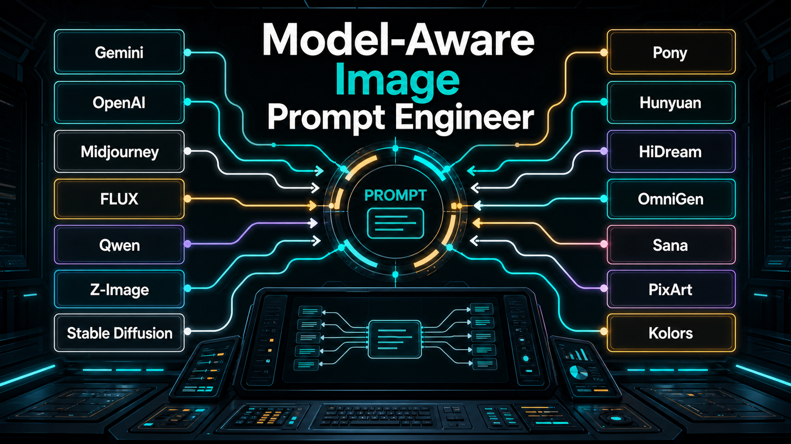
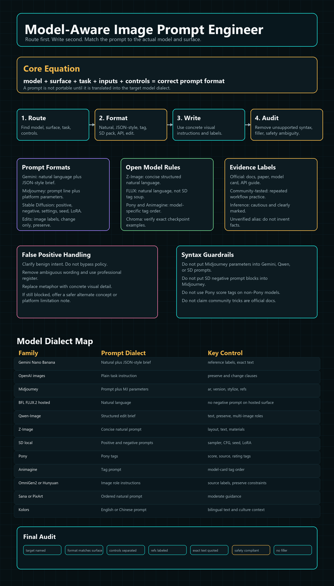

# Model-Aware Image Prompt Engineer



Model-Aware Image Prompt Engineer is a portable skill for writing image prompts that match the target model, platform, and workflow.

It fixes the main weakness in generic prompt guides: they treat every image model as if it understands the same prompt language. That is false. Gemini, OpenAI, Midjourney, FLUX, Qwen, Z-Image, Stable Diffusion, Pony, Illustrious, NoobAI, Animagine, HunyuanImage, HiDream, OmniGen2, Sana, PixArt, Kolors, Chroma, Runway, Ideogram, Firefly, Recraft, and Luma each need different prompt formats and controls.



## What This Skill Does

This skill helps an agent:

- Identify the target image model and platform surface before writing.
- Choose the correct prompt format.
- Convert prompts between model dialects.
- Produce Gemini Nano Banana natural-language prompts and JSON-style briefs.
- Build local Stable Diffusion prompt packs with positive prompts, negative prompts, settings, and LoRA notes.
- Write Midjourney prompts without Stable Diffusion syntax.
- Write FLUX.2 prompts without unsupported negative prompt sections on hosted BFL surfaces.
- Write Qwen-Image and Qwen-Image Edit prompts with labeled references and exact text rules.
- Write Z-Image prompts using structured natural language.
- Handle Pony, Illustrious, NoobAI, and Animagine tag workflows without mixing incompatible tags.
- Reduce false positives through clearer compliant wording.
- Separate official model behavior from community-tested tricks.
- Mark unknown model names as unresolved instead of inventing facts.

## Why This Exists

Current image prompting is model-specific.

A prompt that works in Midjourney can fail in Gemini. A Pony tag prompt can damage a FLUX result. A Stable Diffusion negative prompt is useless in a chat box that has no negative field. A Gemini JSON-style brief can improve structure, but that does not mean every model should receive JSON. A local ComfyUI workflow can expose controls that a hosted version of the same model does not expose.

This skill turns image prompting into a routing problem:

```text
model + surface + task + inputs + controls = correct prompt format
```

## Package Contents

```text
model-aware-image-prompt-engineer/
  SKILL.md
  README.md
  references/
    model-router.md
    prompt-formats.md
    model-cards-commercial.md
    model-cards-open-local.md
    safety-and-false-positives.md
    evaluation-and-iteration.md
  examples/
    prompt-packs.md
  assets/
    hero.png
    infographic.png
  PR_BODY.md
```

## Agent Compatibility

This package is written so any agent can use it.

For Codex or skill-compatible agents:

1. Load `SKILL.md`.
2. Follow the reference loading rules.
3. Load only the reference files needed for the user's model and task.

For general LLM agents:

1. Read `SKILL.md`.
2. Read `references/model-router.md`.
3. Read one model-card file.
4. Read `references/prompt-formats.md`.
5. Use `references/safety-and-false-positives.md` when prompts are rejected or moderation risk exists.

For human use:

1. Start with the model router.
2. Pick the model card.
3. Copy the matching format template.
4. Fill in subject, composition, materials, light, camera, text, references, and settings.

## Core Workflow

1. Identify target model.
2. Identify surface.
3. Identify task.
4. Identify supported controls.
5. Select prompt format.
6. Label input images.
7. Write the prompt.
8. Separate negative prompt and parameters.
9. Audit language and safety.
10. Return the final prompt pack.

## Prompt Formats Included

- Natural-language prompt.
- JSON-style brief.
- API payload.
- Midjourney prompt.
- Stable Diffusion local prompt.
- Tag prompt.
- Edit prompt.
- Reference image role map.
- Exact text rendering prompt.
- Prompt translation format.

## Model Families Covered

Commercial and hosted:

- OpenAI image models.
- Gemini Nano Banana family.
- Midjourney.
- Black Forest Labs FLUX hosted surfaces.
- Stability AI and Stable Image.
- Runway.
- Ideogram.
- Adobe Firefly.
- Recraft.
- Luma.
- Seedream.
- Qwen hosted surfaces.

Open and local:

- Z-Image and Z-Image-Turbo.
- Qwen-Image and Qwen-Image Edit.
- FLUX local workflows.
- Stable Diffusion 1.5.
- SDXL and SD3.5.
- Pony Diffusion XL and Pony-based models.
- Illustrious XL.
- NoobAI XL.
- Animagine XL.
- HunyuanImage 3.0 and Instruct.
- HiDream-I1 and HiDream-E1.
- OmniGen2.
- Sana.
- PixArt-Sigma.
- Kolors.
- Chroma.
- Unknown open models.

## Gemini Nano Banana Rule

When a user asks for Gemini or Nano Banana, return two options unless they ask for one:

1. Natural-language prompt.
2. JSON-style brief.

The JSON-style brief is community-tested structured text. It is useful because Gemini follows labels and nested constraints well. It is not a hidden bypass and should not be described as official unless the active endpoint documents JSON input.

## False Positive Rule

The skill handles false positives by rewriting benign prompts in clearer compliant language.

It does not provide:

- Filter bypass tactics.
- Coded words.
- Misspellings meant to evade safety systems.
- Hidden instructions.
- Disallowed image generation advice.

## Unknown Model Rule

If a user names a model that cannot be verified, the skill marks it as an unresolved alias.

Current unresolved example:

```text
Coin Image
```

The skill should not invent a Coin Image model card without a source link or exact provider name.

## Source Links

Official and primary:

- [OpenAI image generation docs](https://developers.openai.com/api/docs/guides/image-generation)
- [Google Gemini API image generation](https://ai.google.dev/gemini-api/docs/image-generation)
- [Google Nano Banana Pro prompt tips](https://blog.google/products-and-platforms/products/gemini/prompting-tips-nano-banana-pro/)
- [Google DeepMind Gemini 3.1 Flash Image](https://deepmind.google/models/gemini-image/flash/)
- [Google Gemini policy guidelines](https://gemini.google/policy-guidelines/)
- [BFL FLUX.2 prompting guide](https://docs.bfl.ai/guides/prompting_guide_flux2)
- [Hugging Face Diffusers Z-Image](https://huggingface.co/docs/diffusers/en/api/pipelines/z_image)
- [Z-Image technical report](https://arxiv.org/abs/2511.22699)
- [Qwen-Image technical report](https://arxiv.org/abs/2508.02324)
- [Qwen-Image 2.0 technical report](https://arxiv.org/abs/2605.10730)
- [Qwen Cloud image editing docs](https://docs.qwencloud.com/developer-guides/image-generation/image-editing)
- [Qwen-Image Edit model card](https://huggingface.co/Qwen/Qwen-Image-Edit)
- [Tencent HunyuanImage 3.0 Instruct](https://huggingface.co/tencent/HunyuanImage-3.0-Instruct)
- [HunyuanImage 3.0 technical report](https://arxiv.org/abs/2509.23951)
- [HiDream-I1-Full model card](https://huggingface.co/HiDream-ai/HiDream-I1-Full)
- [Hugging Face Diffusers HiDream](https://huggingface.co/docs/diffusers/api/pipelines/hidream)
- [Sana documentation](https://nvlabs.github.io/Sana/docs/sana/)
- [Hugging Face Diffusers Sana](https://huggingface.co/docs/diffusers/api/pipelines/sana)
- [Hugging Face Diffusers Kolors](https://huggingface.co/docs/diffusers/main/api/pipelines/kolors)
- [Hugging Face Diffusers PixArt-Sigma](https://huggingface.co/docs/diffusers/api/pipelines/pixart_sigma)
- [OmniGen2 model card](https://huggingface.co/OmniGen2/OmniGen2)
- [OmniGen2 paper](https://arxiv.org/abs/2506.18871)
- [Animagine XL 4.0 model card](https://huggingface.co/cagliostrolab/animagine-xl-4.0)
- [Illustrious XL v1.1 model card](https://huggingface.co/OnomaAIResearch/Illustrious-XL-v1.1)

Community and workflow:

- [Pony Diffusion XL prompt tags guide](https://stable-diffusion-art.com/pony-diffusion-prompt-tags/)
- [NoobAI XL SeaArt guide](https://docs.seaart.ai/guide-1/6-permanent-events/%68igh%2Dquality-models-recommendation/noobai-xl)
- [Illustrious prompting guide](https://whatlab.ai/guides/illustrious-prompting-guide)
- [Qwen Image ComfyUI guide](https://stable-diffusion-art.com/qwen-image/)
- [Nano Banana JSON prompting analysis](https://miraflow.ai/blog/nano-banana-json-prompting-2026)
- [Nano Banana prompt guide](https://nanobanana.io/prompt-guide)
- [Z-Image Turbo community prompting guide](https://deapi.ai/blog/z-image-turbo-prompting-guide-formula-tips-and-5-example-prompts)

## Validation Checklist

Before publishing changes:

- `SKILL.md` has clear trigger metadata.
- References are split by use.
- Model cards label evidence level.
- Prompt formats do not mix incompatible syntax.
- False-positive handling is compliant.
- Unknown model aliases do not hallucinate facts.
- README links to hero and infographic assets.
- The package can be zipped as a `.skill` file.
- No em dash characters.
- No filler language.
